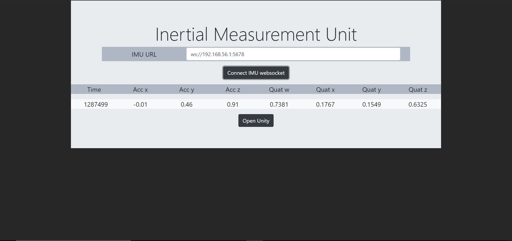
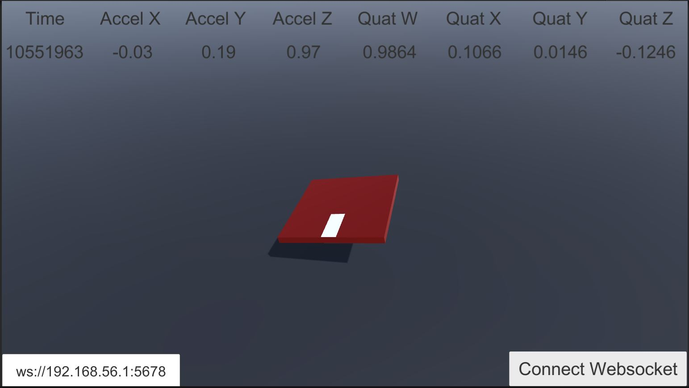

# IoT Inertial Measurement Unit 

An IoT inertial measurement unit that exposes data through WebSocket running on a server and a Unity program that connects to it uses data to rotate a game object in real time. Additionally, there is a browser representation of the rotation of the IMU in the browser done using three.js

Tested and developed with 9DoF Razor IMU M0. For a hookup guide look at: https://learn.sparkfun.com/tutorials/9dof-razor-imu-m0-hookup-guide

App example:  https://javierb07.github.io/iot-imu-unity/

## Instructions:

1) Connect IMU to a server and run the websocket program. Take note of the IP address of the server. Optionally, port forward the websocket service to allow connection from any network. However, you will need a domain and a SSL certificate. Additionally, make sure that the IMU is streaming time, accelX, accelY, accelZ, quatW, quatX, quatY, quatZ (in that order), through the serial channel.

2) Open the index.html file and copy the websocket IP. Check that the measurements appear in the table.

3) Open the three.js program by clicking the Open Graphics button. There, you will see a model of the device rotating accordingly to the real hardware.

4) Open the unity folder in Unity and build a standalone executable of the program. Connect to the websocket and visualize the rotation.

5) In the websocket folder there are Python implementations for WebSockets. Or visit this repo for a Node.js example: https://github.com/javierb07/websocket-example

### Example panel of a connected IMU through WebSocket:

### Example Unity interface of a connected IMU through WebSocket:

